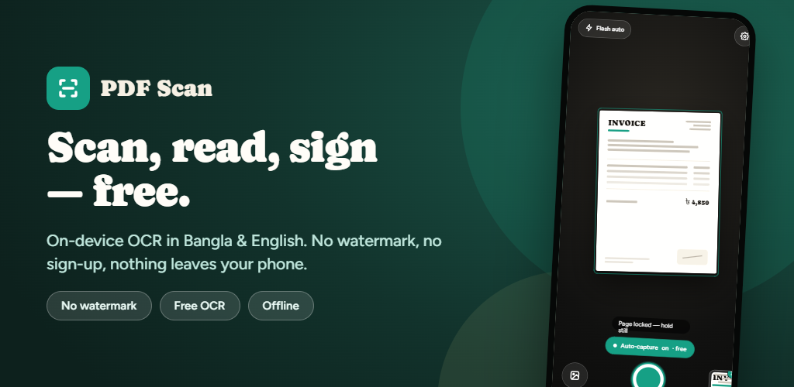
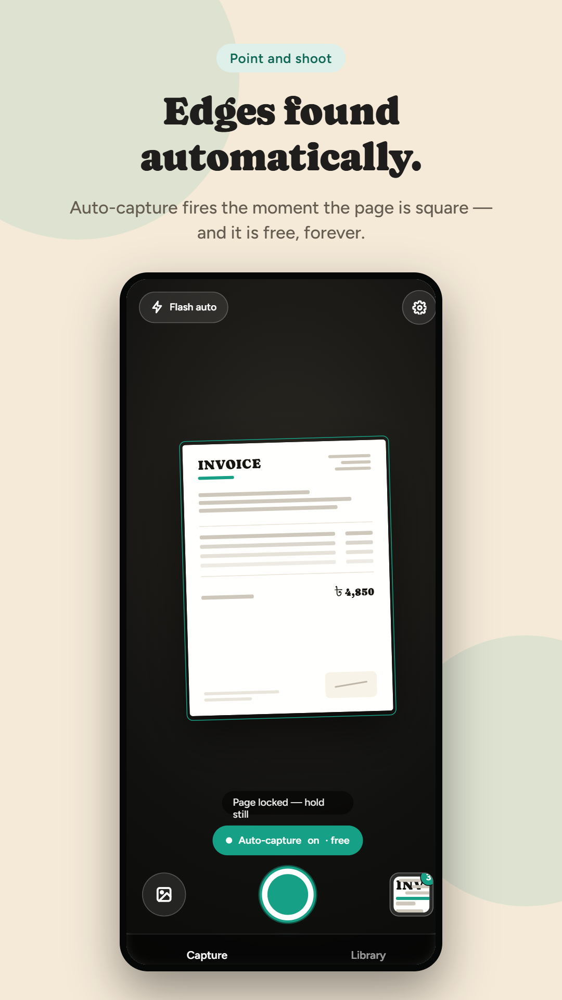
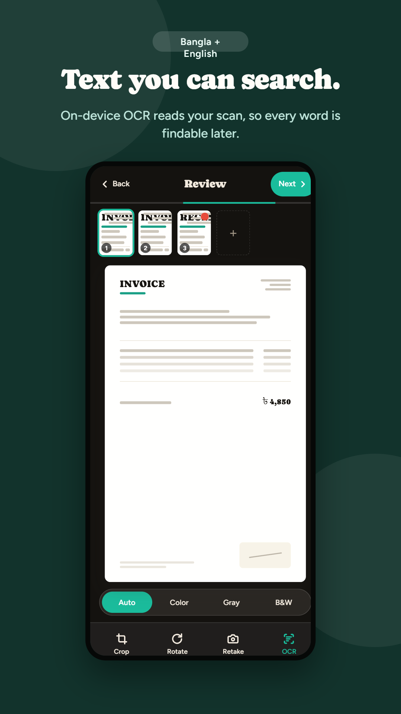
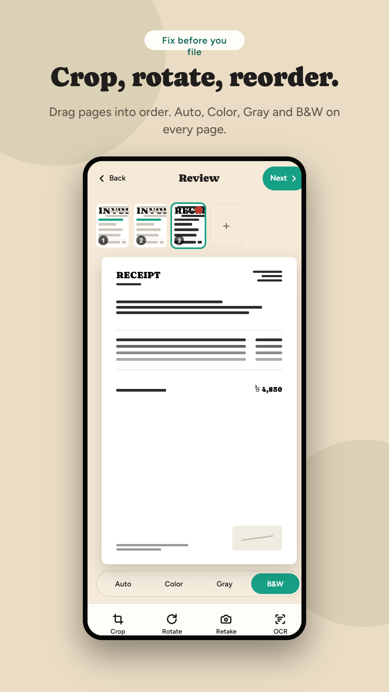
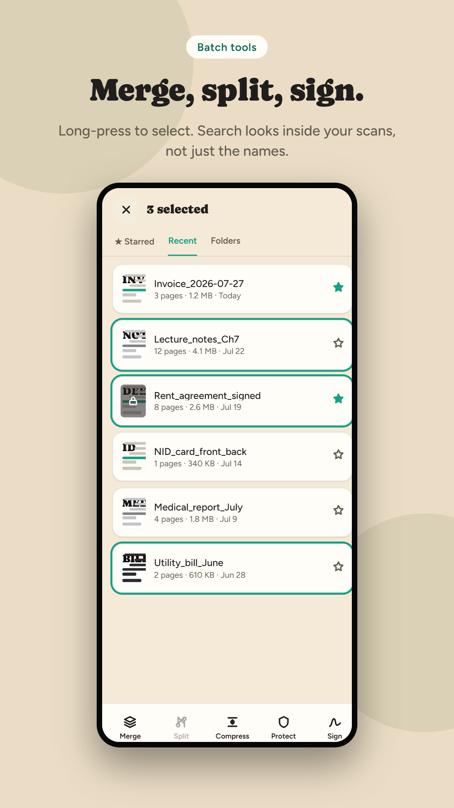
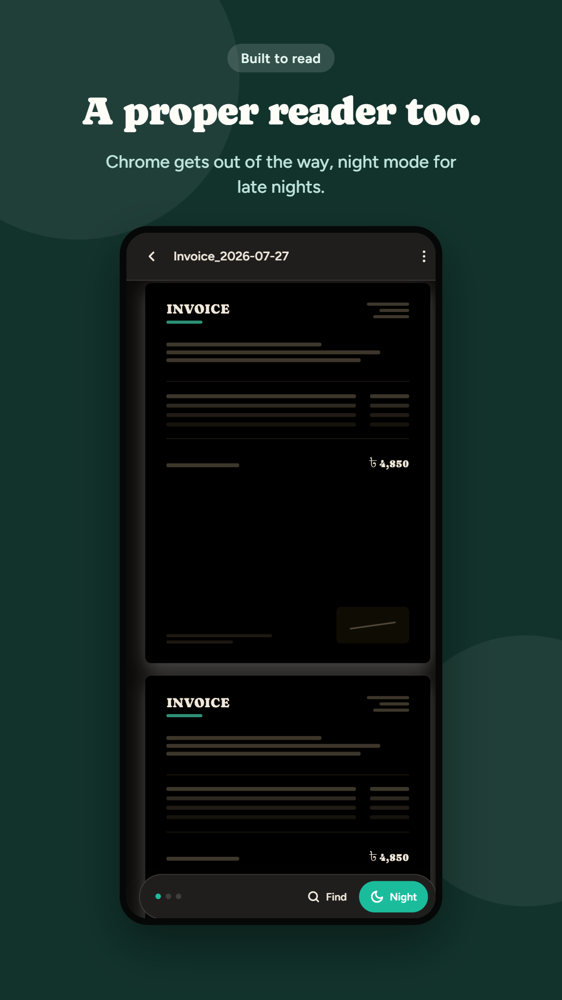
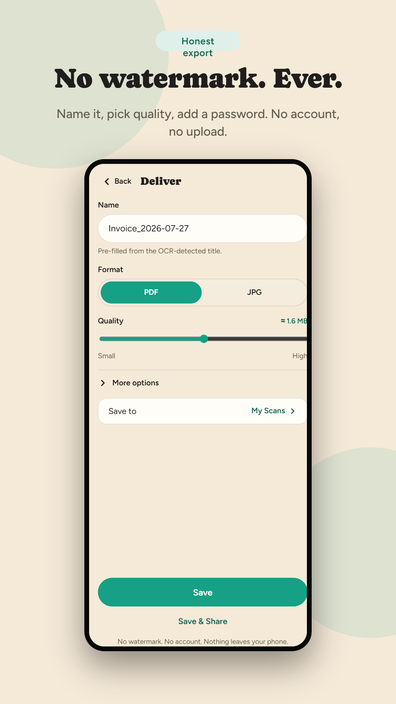

<p align="center">
  
</p>

<p align="center">
  
  
  
  
  
  
</p>

<p align="center">
  A privacy-first document scanner for React Native: point-and-shoot capture with auto edge
  detection, on-device OCR, a full PDF toolkit (merge / split / compress / sign), and a
  built-in reader for PDFs, Office files and images — no accounts, no watermark, nothing
  ever leaves the phone.
</p>

---

## Contents

- [Overview](#overview)
- [Screenshots](#screenshots)
- [Features](#features)
- [Tech stack](#tech-stack)
- [Architecture](#architecture)
- [Getting started](#getting-started)
- [Scripts](#scripts)
- [Roadmap](#roadmap)
- [License](#license)

## Overview

**PDF Scan** turns a phone camera into a full document workflow. A capture screen with
live edge detection and auto-capture feeds a review step (crop, rotate, reorder, color
modes), which feeds an on-device OCR pass and a PDF/JPG export step — all wired through a
single reducer-driven state machine that also powers a library, a native-feeling document
reader, and an e-signature flow.

Everything runs locally: OCR, image processing, and PDF generation all happen on-device,
so scanned documents never touch a server.

## Screenshots

<table>
  <tr>
    <td align="center" width="33%"><br/><sub>Auto edge-detection capture</sub></td>
    <td align="center" width="33%"><br/><sub>Review + searchable OCR</sub></td>
    <td align="center" width="33%"><br/><sub>Crop · rotate · reorder · filters</sub></td>
  </tr>
  <tr>
    <td align="center" width="33%"><br/><sub>Library + batch tools</sub></td>
    <td align="center" width="33%"><br/><sub>Built-in reader + night mode</sub></td>
    <td align="center" width="33%"><br/><sub>Export: name, format, quality</sub></td>
  </tr>
</table>

## Features

### Capture
- Live document detection with auto-capture the moment a page is square, plus manual
  shutter, flash control, and import from the photo library.
- Multi-page capture sessions — keep scanning straight into one document.

### Review & enhance
- Drag-to-reorder pages, crop with a draggable quad, rotate, and retake any page.
- Auto / Color / Gray / B&W rendering per page, powered by an on-device
  [react-native-skia](https://shopify.github.io/react-native-skia/) image pipeline
  (perspective correction, contrast/levels adjustment, half-page splitting for spread scans).

### On-device OCR
- Text recognition via Google ML Kit, fully offline — no image or text ever leaves the
  device.
- Five script models: **Latin, Devanagari (Hindi/Marathi/Nepali), Chinese, Japanese, Korean**.
- Recognized text is embedded as an invisible, position-matched text layer in the exported
  PDF, so pages are searchable and selectable in any PDF viewer — and searchable inside the
  app's own library search.

### PDF toolkit
- **Merge, split, compress and sign** documents in bulk from the library — long-press to
  multi-select.
- Quality-controlled export (adjustable target size) to **PDF or JPG**.
- **Academic export mode**: optional cover page (templated or from an imported photo),
  page borders, running header/footer with page numbers, and a 2-up "Eco-Save" landscape
  layout that prints two scanned pages per sheet.

### E-signatures
- Draw a signature (or reuse a saved one) and place it anywhere on a page with a
  drag/resize overlay, flattened directly into the exported PDF or JPG.

### Universal document reader
- One reader for everything: **PDF, JPG, DOCX, DOC, XLSX, XLS, CSV, TXT** — spreadsheets
  render as sheets, Word docs as formatted text, PDFs and images through a native
  page-by-page viewer with pinch-zoom, in-document find, and a night-reading mode.
- Registers as a system PDF handler on both platforms (open-in from Mail, Files, Drive, etc.).

### Library & organization
- Folders, starring, recents, and full-text search that matches OCR content — not just
  filenames.
- Per-platform export: share sheet, save to the app's own library, or (Android) auto-copy
  every export into a user-chosen folder via the Storage Access Framework.

### Privacy by design
- No account, no cloud upload, no watermark on exports. Scanning, OCR, and PDF assembly all
  happen on-device; the only network-free promise the app makes, it keeps.

## Tech stack

| Area | Technology |
|---|---|
| Framework | [Expo SDK 57](https://docs.expo.dev/versions/v57.0.0/) · React Native 0.86 · React 19 (New Architecture / Fabric) |
| Language | TypeScript (strict mode) |
| Document capture | `react-native-document-scanner-plugin`, `expo-camera`, `expo-image-picker` |
| Image processing | `@shopify/react-native-skia`, `expo-image-manipulator`, `react-native-view-shot` |
| OCR | `rn-mlkit-ocr` (Google ML Kit, on-device) |
| PDF engine | `pdf-lib` (build/sign; OCR text via a bundled glyphless font), `react-native-pdf-jsi` (native render), `expo-print` |
| Office formats | `mammoth` (DOCX), `xlsx` (XLS/XLSX), `papaparse` (CSV) |
| State | Custom reducer/context store (`AppStateContext` + slice reducers) — no Redux dependency |
| Persistence | `expo-sqlite`, `@react-native-async-storage/async-storage`, `expo-file-system` |
| Motion & gestures | `react-native-reanimated` 4, `react-native-worklets`, `react-native-gesture-handler` |
| Fonts/UI | `expo-google-fonts` (Figtree, Caprasimo), `expo-blur`, `@expo/vector-icons` |
| Tooling | EAS Build/Submit, `patch-package` |

## Architecture

The app is a single-activity, state-machine-driven navigator (no React Navigation) — one
`ScreenName` union and a lightweight router drive animated transitions between screens,
with all app state living in one context + slice-reducer store.

```
src/
├── bootstrap/     # AppProviders (theme/store wiring), AppNavigator
├── screens/       # Capture, Review, Deliver, Library, Reader, Settings, Pro, AcademicOptions...
├── components/    # Screen-scoped UI, grouped by feature (capture/, review/, deliver/, reader/, library/, ...)
├── services/      # Business logic: capture pipeline, enhance/OCR, pdf build, signature, search, persistence
├── store/         # AppStateContext + per-domain slice reducers (capture, review, library, reader, settings, ...)
├── navigation/     # Screen router + shared transition definitions
├── theme/         # Design tokens, typography, spacing, ThemeProvider (light/dark)
├── types/         # Shared domain models (LibraryDocument, OcrScript, navigation types, ...)
└── utils/         # Formatting, sanitization, geometry (fitBox), id generation
```

Notable design choices:
- **Everything funnels through `pdfService.buildPdfFromPages`** — standard and 2-up layouts,
  academic stamping, and the invisible OCR text layer all share one page-building pipeline,
  so a searchable PDF is a by-product of normal export, not a separate mode.
- **Format-aware capability flags** (`formatCapabilities.ts`) decide per-document whether
  merge/split/sign or in-reader "find" apply, rather than branching on format throughout the
  UI.
- **Sequential, not parallelized, page processing** in OCR/PDF-build loops — deliberate, to
  cap peak memory instead of holding every page's decoded image in RAM at once.

## Getting started

This project uses several native modules (document scanner, ML Kit OCR, Skia, native PDF
rendering) and **cannot run in the plain Expo Go app** — use a development build.

### Prerequisites
- Node.js 20+ and npm
- [Expo CLI](https://docs.expo.dev/more/expo-cli/) (`npx expo`)
- Android Studio (Android) and/or Xcode (iOS, macOS only)

### Setup

```bash
git clone https://github.com/H-Yeasin/pdfScan.git
cd pdfScan
npm install
```

Run on a device or emulator (this generates the native `android`/`ios` projects on first
run, since they're not committed):

```bash
npm run android   # expo run:android
npm run ios       # expo run:ios (macOS only)
```

For day-to-day development after the native project exists:

```bash
npm start         # expo start, connects to the dev-client build already on-device
```

## Scripts

| Command | Description |
|---|---|
| `npm run android` | Build and launch the Android dev client |
| `npm run ios` | Build and launch the iOS dev client |
| `npm start` | Start the Metro bundler for an existing dev-client build |
| `npm run web` | Start the Expo web bundler |

## Roadmap

The **Pro** tier surfaced in-app is scaffolded for the following (not yet monetized/gated):
- Batch OCR and batch export across many files
- Folder lock with fingerprint or passcode
- Additional theme accents
- Automatic backup to Drive/Dropbox

Other known gaps:
- "Password protect" in the export sheet currently tags a document as protected in the
  library UI; it does not yet encrypt the PDF itself.
- Bengali script isn't covered by the current OCR script set.

## License

MIT — see [LICENSE](LICENSE).
